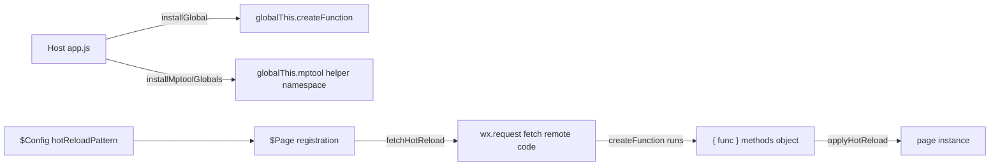

# CLAUDE.md

**mptool** is a lightweight mini-program (QQ/WeChat) enhancement framework: it provides enhanced lifecycles, cross-component communication, file/network/parsing utilities, and ships a self-built JS interpreter that lets mini-apps bypass the disabled `eval`/`new Function` for page hot reload.

- **Repository**: [miniapp-tool/mptool](https://github.com/miniapp-tool/mptool)
- **Author**: Mr.Hope (<mister-hope@outlook.com>)
- **Package manager**: pnpm (workspace monorepo, 12 packages, lerna-lite for releases)
- **Build**: tsdown (each package bundles to a single file); **Test**: vitest + istanbul; **Lint/Format**: oxlint + oxfmt; **Commits**: Conventional Commits, husky + nano-staged on staged files

## Quick Commands

| Command                            | Purpose                                                 |
| ---------------------------------- | ------------------------------------------------------- |
| `pnpm run build`                   | Sync enhance → skyline-enhance, then build all packages |
| `pnpm run dev`                     | Same as build, but dev mode                             |
| `pnpm run test`                    | Run all tests (with coverage)                           |
| `pnpm run lint`                    | oxlint --fix + oxfmt (auto-fix)                         |
| `pnpm run lint:check`              | oxlint + oxfmt --check (CI gate)                        |
| `pnpm run copy`                    | Copy `@mptool/all` dist to demo                         |
| `pnpm run changelog`               | Regenerate CHANGELOG.md                                 |
| `pnpm run docs:build` / `docs:dev` | VuePress docs                                           |
| `pnpm run release`                 | clean → build → version → publish → sync                |

## Package Map

| Package                   | Responsibility                                                                                                                      |
| ------------------------- | ----------------------------------------------------------------------------------------------------------------------------------- |
| `@mptool/enhance`         | Enhancement framework: $App / $Page / $Component, extra lifecycles, cross-component communication, navigation lock, page hot reload |
| `@mptool/skyline-enhance` | WeChat dist 3.0 version of enhance (slim: no onNavigate / onPreload / onAppLaunch / navigation lock)                                |
| `@mptool/run`             | Self-built JS interpreter replacing `eval`/`new Function`, powers page hot reload                                                   |
| `@mptool/all`             | Full bundle (api + enhance + file + net + parser), single file                                                                      |
| `@mptool/skyline`         | WeChat dist 3.0 bundle (net + skyline-enhance + file + parser)                                                                      |
| `@mptool/api`             | Common APIs (clipboard / contact / media / network / ui / update)                                                                   |
| `@mptool/file`            | File operations and expiring storage                                                                                                |
| `@mptool/net`             | Networking (Headers / URLSearchParams / Cookie)                                                                                     |
| `@mptool/parser`          | HTML parsing → rich-text nodes                                                                                                      |
| `@mptool/encoder`         | GBK / GB2312 encoding                                                                                                               |
| `@mptool/shared`          | Shared utilities (emitter / logger / queue / type etc.)                                                                             |
| `@mptool/mock`            | wx API mock (dev/test only)                                                                                                         |

## Repository Structure

```text
mptool/
├── packages/             # 12 packages
├── scripts/              # Build/release tooling: sync-enhance.ts, copy-package.ts, tsdown.ts, atob.ts (atob polyfill) etc.
├── demo/                 # Demo mini-app (depends on @mptool/all)
├── docs/                 # VuePress docs (api / enhance / file / mock / net / parser / run / guide)
├── lerna.json            # lerna-lite release config
├── oxlint.config.ts      # Lint rules
└── oxfmt.config.ts       # Format rules
```

Each package: `src/index.ts` (entry) + `__tests__/` (vitest, incl. `.spec-d.ts` type tests) + package.json / README / LICENSE / CHANGELOG.

## Core Architecture

### 1. Enhancement framework (@mptool/enhance)

- **$App**: App wrapper with the `onAwake` lifecycle
- **$Page**: Page wrapper with `onAppLaunch` / `onNavigate` / `onPreload` / `onAwake` lifecycles; triggers hot reload on registration
- **$Component**: Component wrapper with ref support and the `$call` method
- **emitter**: Global event bus for cross-component / page communication
- **$Config**: Global config — `home`, routes (`defaultPage` / `pages` or `getPath`), navigation options (`maxDelay` / `minInterval`), page/component hooks (`extendPage` / `injectPage` / `extendComponent` / `injectComponent`), hot reload URL `hotReloadPattern`
- **$bindGo** etc.: Navigation proxies with before/after hooks; `navigator/` provides lock-guarded navigation triggers

### 2. JS interpreter (@mptool/run)

Mini-app environments disable `eval` and `new Function`, so `@mptool/run` implements a full "lex → parse → AST → evaluate" interpreter pipeline supporting all of ES5 plus common ES6 (class / for...of / async / BigInt, toggleable). **It is not a security sandbox** — built-ins reuse the host runtime, so it only targets trusted / semi-trusted dynamic code.

- `run(code, options)`: run once; returns a Promise when the code is async
- `runSync(code, options)`: run synchronously; throws when async is triggered
- `createSandbox(options)`: reusable sandbox sharing global state (`run` / `setGlobal` / `getGlobal`)
- `createFunction(args, body, options)`: replaces `new Function`; preserves the caller's `this` (use `.call(page)` to bind a page instance)
- `installGlobal()`: mounts `createFunction` onto `globalThis.createFunction`

### 3. Page hot reload (core pipeline)

Hot reload lets a server push page methods at runtime, tying enhance, run and all/skyline together:



- The host calls `installGlobal()` (from `@mptool/run`) in `app.js` to mount `createFunction`; if hot-reload code needs helpers, it also calls `installMptoolGlobals()` (from `@mptool/all` / `@mptool/skyline`) to mount `globalThis.mptool`
- Once `$Config` sets `hotReloadPattern` (the `$name` placeholder is replaced with the page name), `$Page` fetches the remote code asynchronously via `wx.request` at registration
- The fetched code is executed with `createFunction` and expected to return `{ func: { ...methods } }` (or a plain methods object)
- `applyHotReload` merges the methods onto the page instance; if the remote code is not ready yet, the instance is registered and patched once the fetch resolves
- Hot reload is best-effort: it never blocks registration/loading, all fetch/parse/run failures are silent, and non-200 status codes are ignored

## Inter-package Dependencies

Workspace packages are inlined at build time (tsdown single-file dist), so runtime dependencies are minimal; almost all cross-package references are devDependencies.

```text
@mptool/all             → api, enhance, file, net, parser, shared (dev)
@mptool/api             → shared (dev), mock (dev)
@mptool/enhance         → shared (dev), run (dev), mock (dev)
@mptool/file            → shared (dev), mock (dev)
@mptool/net             → shared (runtime), set-cookie-parser (dev), mock (dev)
@mptool/parser          → htmlparser2 / dom-serializer / domhandler (runtime), mock (dev)
@mptool/run             → mock (dev), miniprogram-api-typings (peer)
@mptool/shared          → base64-arraybuffer (dev), mock (dev)
@mptool/skyline         → file, net, parser, skyline-enhance (dev)
@mptool/skyline-enhance → shared (dev), run (dev), mock (dev)
```

All packages except `@mptool/encoder` and `@mptool/mock` declare `miniprogram-api-typings` as a peer dependency (`@mptool/mock` depends on it directly).

## Key Conventions & Pitfalls

### enhance ↔ skyline-enhance dual-package sync (easiest to get wrong)

`skyline-enhance` is a slim version of `enhance`; they share **12 files** that `scripts/sync-enhance.ts` copies from enhance to skyline-enhance before every build/dev: app/index, app/typings, component/index, component/store, config/index, emitter/index, emitter/typings, hotReload, navigator/index, navigator/typings, page/index, index.ts.

**Note**: `config/typings.ts` and `page/page.ts` are NOT in the sync list — they are maintained per package, and skyline-enhance's `page/page.ts` is intentionally slim. When changing `$Page` / `$Config`, edit both packages (e.g. the hot reload integration touched both `page/page.ts` files).

### Other conventions

- `@mptool/run` is **not bundled** into `@mptool/all` / `@mptool/skyline`; the host must import it separately and call `installGlobal()`
- Cross-package tests resolve `@mptool/mock` to its **dist**, so build mock first (`pnpm --filter @mptool/mock build`) after changing its source
- Build output is a single-file dist (workspace deps inlined); avoid circular package dependencies
- Keep `docs/` (VuePress) in sync after adding / changing APIs
- Tests must be shuffle-safe: each case uses isolated state and independent overrides

## Testing

- vitest 4 + istanbul coverage; `pnpm test` runs everything with coverage
- Coverage scope `packages/*/src/**`: parser / shared reach 100% statement coverage; file / net ~99% (remaining branches need non-wx environments, e.g. `env === "js"` / `"qq"` checks)
- `@mptool/run` has extensive lexer / parser / interpreter / async / edge-case tests; the hot-reload spec exists in both enhance and skyline-enhance and must be kept in sync

## Common Tasks

### Fixing a bug

Write a failing test first → fix the code → make tests pass → check side effects in dependent packages.

### Adding a feature

1. Decide which package owns it; 2. Follow the package structure; 3. Update `index.ts` exports; 4. Update `docs/`; 5. If it touches `$Page` / `$Config`, sync skyline-enhance (`hotReload.ts` syncs automatically; `page/page.ts` and `config/typings.ts` need changes in both packages).

### Adding a package

1. Create `packages/<name>/` (lerna picks up `packages/*` automatically); 2. If it belongs in a bundle, update `packages/all` (or `packages/skyline`) exports; 3. Add `docs/` documentation.

## Key Source Locations

- **enhance**: `packages/enhance/src/` — `app/`, `page/`, `component/`, `emitter/`, `navigator/`, `bridge.ts` (navigation & mounting), `hotReload.ts` (hot-reload fetch/apply), `config/`
- **run interpreter**: `packages/run/src/` — `lexer.ts` (lexing), `parser.ts` (parse → AST), `interpreter.ts` (evaluation), `environment.ts` (global/sandbox env), `ast.ts`, `value.ts`
- **net**: `packages/net/src/` — `cookie.ts`, `cookieStore.ts`, `request.ts`, `headers.ts`
- **file / storage**: `packages/file/src/` — `file.ts`, `storage.ts`
- **parser**: `packages/parser/src/` — `parser.ts`, `richText.ts`
