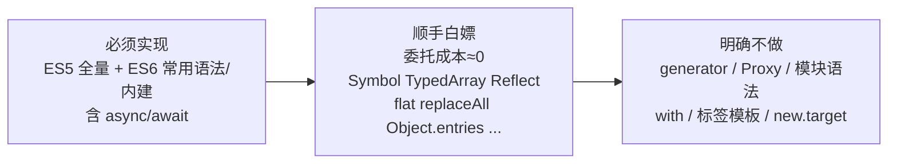

# @mptool/run — 小程序自定义 Eval 设计方案

> 状态：已定稿（2026-08-06 第三轮：全部决策已确认；第四轮：补充 §4.6 错误处理原则，测试策略同步从简）
>
> 日期：2026-08-06

## 1. 背景与定位

小程序运行环境（微信 iOS/Android/DevTools）出于安全考虑禁用了 `eval` 与 `new Function`，导致无法执行动态下发的脚本。`@mptool/run` 提供一个**自研的 JS 解释器**，用"词法分析 → 语法分析 → AST → 求值"的方式在受限环境下执行 ES5 全量 + 常用 ES6 子集的代码。

一句话定位：**受限代码求值器（restricted evaluator），不是安全沙箱**（见 §4.1）。

**平台定位：微信优先（最低基础库 3.8.2）**。QQ 环境不在支持范围内，边界由 QQ 使用者自行处理——`@mptool/run` 只为微信使用者提供便利。

## 2. 宿主运行环境调研结论（2026-08-06）

### 2.1 微信小程序

官方文档（[运行环境](https://developers.weixin.qq.com/miniprogram/dev/framework/runtime/env.html)、[JS 支持情况](https://developers.weixin.qq.com/miniprogram/dev/framework/runtime/js-support.html)）：

- **逻辑层引擎**：iOS/iPadOS/macOS → **JavaScriptCore**（无 JIT，性能明显低于其他平台）；Android → **V8**；Windows/Mac 客户端 → Chromium；开发者工具 → **NW.js**（Chromium）。
- **运行限制**：不支持 `eval` 执行 JS；不支持 `new Function` 创建函数（仅 `new Function('return this')` 例外）。→ 正是 `@mptool/run` 的动机。
- **API 差异由基础库内置 core-js Polyfill 补齐**；**语法差异无法 polyfill**，`async/await` 等高级语法需要借助"ES6 转 ES5"代码转换工具（只作用于源文件，不作用于运行时字符串）。
- **无法被 Polyfill 的 API**：`Proxy`（部分低版本客户端不可用，官方建议尽量避免使用）。
- **Promise 时序差异**：iOS 15 及以下，基础库用 `setTimeout` 模拟 Promise（普通宏任务而非微任务），时序与标准不同；iOS 16 及以上无差异。
- 官方提供 [miniprogram-compat](https://github.com/wechat-miniprogram/miniprogram-compat) 开源库（`getBrowsersList(version)` / `getPolyfillInfo(version)` 返回 core-js 版本与模块列表）可精确查询各基础库版本的能力与 polyfill 覆盖，并有[在线支持度表](https://wechat-miniprogram.github.io/miniprogram-compat/)。

### 2.2 QQ 小程序

官方文档（[运行环境](https://q.qq.com/wiki/develop/miniprogram/frame/useful/useful_env.html)）：

- **逻辑层引擎**：iOS → JavaScriptCore；Android → **X5 JSCore**（腾讯 TBS，基于 Mobile Chrome 57 内核，比微信 Android 的 V8 旧）；开发者工具 → NW.js（Chromium 60）。
- **运行限制**：同样不支持 `eval`、`new Function`。
- 基础库同样内置 polyfill 弥补 API 差异。
- **ES6 API 明确不支持项**：`Proxy`、`Array.prototype.values`、`String.prototype.normalize`（官方支持表标注 ✘）。
- **不在支持范围**：QQ 端能力弱于微信（X5 JSCore 为 Chrome 57 内核），且 `Proxy`/`Array.values`/`normalize` 缺失。本包不针对 QQ 做边界处理，QQ 使用者需自行处理（见 §1 平台定位）。

### 2.3 支持度数据（miniprogram-compat 核查，最低基础库 **3.8.2**）

`miniprogram-compat` 语义：未列出版本取"≤ 它的最大已列版本"的支持度（`getBrowsersList`/`getPolyfillInfo` 用 `semver.maxSatisfying`）。**3.8.2 落在 3.6.1 与 3.13.0 之间 → 取 3.6.1 列**：

- `getBrowsersList("3.8.2")` → **`ios 14` + `chrome 86`**（iOS 14 的 JavaScriptCore、Android 的 V8/Chrome 86）
- `getPolyfillInfo("3.8.2")` → **core-js 3.38.1** + 模块列表

3.6.1（=3.8.2）列支持度（原生 + polyfill）：

| 类别                      | 支持度        | 类别                | 支持度        |
| ------------------------- | ------------- | ------------------- | ------------- |
| Array                     | 51/51         | Object              | 32/33         |
| String                    | 46/46         | Number              | 24/24         |
| Math                      | 44/46         | Date                | 60/61         |
| RegExp                    | 29/32         | JSON                | 5/8           |
| Symbol                    | 23/24         | Map / Set           | 17/20 / 16/23 |
| WeakMap / WeakSet         | 8/11 / 7/8    | Promise             | 12/15         |
| Proxy / Reflect           | 16/16 / 14/14 | **BigInt**          | **9/9**       |
| TypedArray / DataView     | 46/46 / 21/28 | ArrayBuffer         | 6/13          |
| AsyncFunction / Generator | 2/2 / 4/4     | globalThis          | 1/1           |
| classes / functions       | 4/10 / 20/20  | grammar / operators | 20/21 / 85/89 |

要点：**iOS 14 + Chrome 86 是 ES2020 级引擎**，ES6 内建（`Symbol`/`Map`/`Set`/`WeakMap`/`WeakSet`/`Promise`/`TypedArray`/`Reflect`/`Proxy`/**`BigInt`**/`globalThis`）均为**原生支持**（3.6.1 的 polyfill 列表里已无 `es.symbol`/`es.map`/`es.set`/`es.promise` 等 ES6 模块）；`flat/flatMap`、`padStart/End`、`Object.entries/values/fromEntries`、`replaceAll`、可选链/空值合并等 ES2016-2021 也基本原生。partial 数字的缺口（如 Set 16/23、Map 17/20、RegExp 29/32）在 ES2023+ 新方法（`Set.union` 等），**不影响 ES6 范围**。

### 2.4 对方案的三个关键结论

1. **API 委托宿主完全可行**：3.8.2 基线 = iOS 14 JSCore + Chrome 86 V8 + core-js 3.38.1，ES2015+ 内建（含 `Symbol`/`Map`/`Set`/`Promise`/`TypedArray`/`Reflect`/`Proxy`/**`BigInt`**/`globalThis`）原生或 polyfill 全部可用。文档声明"微信端要求基础库 ≥ 3.8.2"即可放心委托。
2. **语法必须自研**：宿主禁 `eval`/`new Function` → 无法"编译回宿主执行"；DevTools 的 ES6→ES5 只处理源文件，不处理运行时字符串。因此 `@mptool/run` 的语法支持完全由自己的 parser 决定，与宿主语法能力无关（宿主只提供 API 委托）。
3. **调研修正了部分特性的成本评估**（见 §6.3）：`Symbol`/`TypedArray`/`Reflect`/**`BigInt`** 在 3.8.2 均为原生、委托成本≈0；`Proxy` 在 3.8.2 也原生可用（16/16），但因解释器内 trap 语义不一致 + 逃逸面 + QQ 端不支持，维持不做。

### 2.5 跨端差异速查

| 端                    | 逻辑层引擎                  | 备注                                                   |
| --------------------- | --------------------------- | ------------------------------------------------------ |
| 微信 iOS/iPadOS/macOS | JavaScriptCore              | 无 JIT；3.8.2 基线 iOS 14；iOS≤15 Promise 为宏任务时序 |
| 微信 Android          | V8                          | 性能最好                                               |
| 微信 DevTools         | NW.js / Chromium            | 仅供调试                                               |
| QQ iOS                | JavaScriptCore              | —                                                      |
| QQ Android            | X5 JSCore（Chrome 57 内核） | 相对最旧；无 Proxy / Array.values / normalize          |
| QQ DevTools           | NW.js（Chromium 60）        | 仅供调试                                               |

两端均：禁 `eval` / `new Function`；基础库内置 core-js polyfill 兜底 API。

**支持范围：仅微信端**（最低基础库 3.8.2，即上表微信三行）。QQ 三行仅供调研参考，不承诺兼容。

## 3. 总体架构

```mermaid
graph TD
  SRC[源代码字符串] --> LEX[Lexer 词法分析]
  LEX --> PARSER[Parser 递归下降 → AST]
  PARSER --> INTERP[Interpreter 求值器]
  INTERP --> FRAME[Frame 显式栈求值器<br/>调用压帧/返回弹帧/可挂起恢复]
  FRAME --> ENV[Environment 作用域链<br/>函数级 + 块级/TDZ]
  FRAME --> FN[Function 调用帧<br/>this / new / 闭包]
  INTERP --> OBJ[Object 属性/原型/描述符]
  INTERP --> BI[Builtins 内建委托层]
  BI --> HOST[宿主运行时<br/>Array String Number Math Date RegExp<br/>JSON Map Set Promise Symbol ...]
  ASYNC[async 挂起恢复<br/>await 提升 + 帧挂起<br/>宿主 Promise 驱动续延]
  FRAME --> ASYNC
  SBOX[Sandbox 全局对象/白名单/步数上限] --> INTERP
  API[run / runSync / createSandbox / createFunction] --> SBOX
```



核心思路：**"语法自己解析、语义尽可能委托宿主"**。我们只实现语言层面的执行语义（作用域、调用、`this`、`new`、原型链、控制流、async 挂起恢复），所有内建对象直接复用宿主运行时。

求值器采用**帧式（显式栈）设计**而非递归树遍历，这是为了以低成本支持 `async/await`（见 §7）——这是本方案与第一版最重要的架构调整。

## 4. 核心设计决策

### 4.1 值模型（已确认：方案 A 宿主委托）

| 方案                      | 做法                                                                                                              | 成本       | 是否真沙箱 |
| ------------------------- | ----------------------------------------------------------------------------------------------------------------- | ---------- | ---------- |
| **A：宿主委托**（已确认） | 数字/字符串/布尔直接用宿主原始值；对象直接用宿主 `{}`/`[]`；数组方法、原型链、`typeof`、`instanceof` 全部原生可用 | 低-中      | **否**     |
| B：自持值模型             | 所有对象自研包装，内建全部自己实现                                                                                | 高（翻倍） | 是         |

- 数组用宿主数组 → ES5 数组方法、原型链、属性描述符、正则、`Date`、`JSON` 全部原生可用。
- 解释器函数对象做成**宿主可调用的包装**：宿主 `Array.map(cb)` 传入我们的箭头函数时，通过 wrapper 的 `.call` 把调用送回解释器新建调用帧。宿主回调与解释器函数双向互操作。
- **委托安全性由基础库 core-js polyfill 保证**（§2.4-1）：文档声明建议最低基础库版本即可。
- **⚠️ 必须明确的安全边界**：数组是宿主数组，用户代码可用 `[].constructor.constructor("return this")()` 之类手法触达宿主全局，**绕过沙箱**。定位为"受信/半受信动态代码执行器"，安全能力靠"全局白名单 + 步数/栈上限"，**不是**恶意代码隔离。文档必须显著标注。

### 4.2 作用域模型

- ES5：函数作用域链（`Environment` 声明式记录 + `outer` 指针），`var`/函数声明提升。
- ES6：块级作用域，`let`/`const` 存入块环境，TDZ 用"已声明未初始化"哨兵值实现。
- 求值期按 AST 结构动态建环境，无需独立 scope analysis。
- 内置实现所需的宿主能力通过**运行时注入**访问，不走用户可见作用域链。

### 4.3 函数 / this / new

- 函数对象保存 `[[Environment]]`（闭包）、参数表、函数体、`[[ThisMode]]`（sloppy / strict / arrow）。
- 普通调用：sloppy 下 `this === undefined/null` 装箱为全局；strict 下保持 `undefined`。
- `new`：创建对象 → 链接 `constructor.prototype` → 执行 → 返回对象。
- 箭头函数：词法 `this`、无 `arguments`/`prototype`/`new`。
- `call`/`apply`/`bind` 委托宿主 `Function.prototype`（wrapper 是宿主函数，天然可用）。

### 4.4 内建委托

`Object.defineProperty`、`Object.create`、`Object.getOwnPropertyDescriptor`、`Object.freeze` 等直接调宿主；正则字面量/`RegExp` 直接用宿主 `RegExp`；`JSON` 直接委托。唯一需要自研包装的是**会回调解释器函数**的方法（`forEach/map/filter/reduce/sort` 比较器等），用 §4.1 的 wrapper 解决。

### 4.5 安全机制

- **步数上限**（`maxSteps`，每条语句/表达式计数）——比 `timeout` 可靠，解释器是同步的。
- **调用栈深度上限**（`maxStack`）——帧式设计下直接数帧数，不依赖宿主 JS 栈。
- **全局白名单**：默认只暴露受控内建，`wx`、`console`、`setTimeout` 等一律不暴露，必须 `options.globals` 显式注入。
- 不提供原生 `Function`/`eval` 全局，改为 API 层沙箱版（见 §9）。
- 禁用 `Function.caller` / `arguments.caller`。

### 4.6 错误处理原则（重要）

- **不追求与标准 JS 运行环境（JSCore/V8）的错误语义完全对齐**。假定用户传入的代码是**可运行的正常代码**。
- 对错误只做"合理幅度"的处理：能正常抛出错误即可（如引用未定义变量抛 `ReferenceError`、语法错误抛 `SyntaxError`、步数/栈超限抛 `Error`），**不保证**错误类型、错误消息、抛错时机与标准引擎逐字一致。
- 目的：大幅减少错误路径的兜底代码，把核心投入放在"让正常代码在小程序环境里跑起来"。本质是给宿主运行环境"打补丁"（替代被禁的 `eval`/`new Function`），而非重新实现一个规范级引擎。
- 影响：后续所有轮次的实现与测试都遵循此原则——**正常路径必须正确，错误路径只要求"能抛错"**。

## 5. ES5 全量清单与边界

### 5.1 语言核心（全量实现）

- 语句：`var`、`if/else`、`for`、`for-in`、`while`、`do-while`、`switch`、`try/catch/finally`、`throw`、`return`、`break`、`continue`、函数声明/表达式、块、空语句、`debugger`。
- 表达式：字面量、数组/对象字面量、成员访问 `.`/`[]`、调用、`new`、`delete`、`typeof`、`void`、`instanceof`、`in`、一元、二元、三元、赋值（含复合）、逗号、`this`、`arguments`。
- 作用域与闭包、提升、异常与错误类型（`Error` 家族 7 种）。
- 原型链、属性描述符、getter/setter、`Object.defineProperty(s)/create/getOwnPropertyDescriptor(s)/getPrototypeOf/keys/getOwnPropertyNames/freeze/seal/preventExtensions` 及对应 `is*`。
- `Function.prototype.call/apply/bind`、`Array.isArray`、`String.prototype.trim`、`Date.now/toISOString`。

### 5.2 内建对象（全量，委托宿主）

`Object`、`Array`（ES5 方法全集）、`String`、`Number`、`Boolean`、`Math`、`Date`、`RegExp`、`JSON`、`Error` 家族、`parseInt/parseFloat/isNaN/isFinite`、`encodeURI(Component)/decodeURI(Component)/escape/unescape`、`arguments` 对象（sloppy 下参数映射 + `length` + `callee`）。

### 5.3 名义 ES5 但"明确降级/跳过"的项

| 特性                                   | 处理                                                                                                                                                                                                                                                                           | 理由                                                         |
| -------------------------------------- | ------------------------------------------------------------------------------------------------------------------------------------------------------------------------------------------------------------------------------------------------------------------------------ | ------------------------------------------------------------ |
| `with` 语句                            | **明确不支持**，解析到即抛"unsupported"                                                                                                                                                                                                                                        | 严格模式禁用、实际代码几乎不用；有安全隐患。ES5 里唯一跳过项 |
| 严格模式                               | **现状（2026-08 修订）**：仅支持 `RunOptions.strict`（全局严格模式）——`this` 不装箱、未声明赋值抛 `ReferenceError`、`delete` 标识符抛错、`arguments` 不映射、sloppy 赋值收紧。**函数内 `"use strict"` 指令暂未实现**（解析器不做指令序言检测），属已知缺口；完整逐条执行成本高 | 完整逐条执行成本高，文档列出未强制项                         |
| `Function.caller` / `arguments.caller` | 禁用                                                                                                                                                                                                                                                                           | 安全 + 极少用                                                |
| `eval` 的完整动态语义                  | API 提供沙箱版（直接/间接 eval 均可执行，但不出沙箱）                                                                                                                                                                                                                          | §4.5                                                         |

> 关于"一定要实现 ES5"：**规范级 100% 兼容（test262 全绿）连主流引擎都做不到**。承诺"**实用全量**"：语言核心 + 常用内建全量实现，上表 4 项明确降级并在文档公示。

## 6. ES6 功能矩阵

> 判据：**内建与方法几乎免费**（委托宿主），**语法/语义层才花钱**。所以"砍 ES6"砍的是语法特性（generator、Proxy），而不是内建方法（能白嫖就白嫖）。

### 6.1 语法特性

| 特性                                                   | 使用率 | 实现成本         | 决定                                          |
| ------------------------------------------------------ | ------ | ---------------- | --------------------------------------------- |
| `let`/`const` + 块作用域 + TDZ                         | 极高   | 中               | ✅ 实现                                       |
| 箭头函数（词法 this）                                  | 极高   | 低-中            | ✅ 实现                                       |
| 模板字符串（嵌套插值）                                 | 极高   | 低               | ✅ 实现                                       |
| 解构赋值（数组/对象/嵌套/默认/rest）                   | 高     | 中               | ✅ 实现                                       |
| 默认参数                                               | 高     | 低               | ✅ 实现                                       |
| Rest 参数 `...args`                                    | 高     | 低               | ✅ 实现                                       |
| Spread（数组字面量、函数调用）                         | 高     | 低               | ✅ 实现                                       |
| 对象字面量增强（简写属性/计算键/方法简写）             | 高     | 低               | ✅ 实现                                       |
| `for...of`（break/continue/return、多集合）            | 高     | 中-低            | ✅ 实现（委托宿主迭代协议，见 §6.3）          |
| `class` / `extends` / `super` / static / getter-setter | 中-高  | 中-高            | ✅ 实现（最大语法块）                         |
| **`async`/`await`**                                    | 高     | 中（帧式架构下） | ✅ 实现（成本讨论见 §7）                      |
| `0b`/`0o` 字面量、`\u{...}`                            | 低     | 低               | ✅ 顺手                                       |
| **对象字面量 spread**（ES2018）                        | 高     | 极低             | ✅ 顺手白嫖（超版本但零成本）                 |
| 标签模板（tagged templates）                           | 低     | 中-低            | ❌ 已确认跳过                                 |
| `new.target`                                           | 极低   | 中               | ❌ 已确认跳过                                 |
| **生成器 `function*` / `yield` / `yield*`**            | 中-低  | 极高             | ❌ 已确认跳过（帧式架构下 Phase 3 候选）      |
| `import`/`export` 模块                                 | —      | —                | ❌ 已确认排除（打包器职责，动态代码是单脚本） |

### 6.2 内建对象

| 特性                                                                                | 使用率 | 成本                        | 决定                                                                                      |
| ----------------------------------------------------------------------------------- | ------ | --------------------------- | ----------------------------------------------------------------------------------------- |
| `Array`: `find/findIndex/includes/fill/copyWithin`                                  | 高     | 极低（委托）                | ✅                                                                                        |
| `Array.from` / `Array.of`                                                           | 中     | 极低                        | ✅                                                                                        |
| `Array`: `entries/keys`（`values` 注意 QQ 端不支持，见 §2.2）                       | 低     | 极低                        | ✅                                                                                        |
| `Object.assign`                                                                     | 高     | 极低                        | ✅                                                                                        |
| `Object.setPrototypeOf`                                                             | 低     | 极低                        | ✅                                                                                        |
| `Object.entries/values`（ES2017）                                                   | 高     | 极低                        | ✅ 顺手白嫖                                                                               |
| `Object.fromEntries`（ES2019）                                                      | 中     | 极低                        | ✅ 顺手白嫖                                                                               |
| `String`: `includes/startsWith/endsWith/repeat/padStart/padEnd`                     | 高     | 极低                        | ✅                                                                                        |
| `String`: `fromCodePoint/codePointAt`                                               | 低     | 极低                        | ✅                                                                                        |
| `String`: `replaceAll`（ES2021）/ `matchAll`（ES2020）                              | 中-高  | 极低                        | ✅ 顺手白嫖                                                                               |
| `String`: `normalize`                                                               | 极低   | 高                          | ❌（宿主也不支持，QQ 明确 ✘）                                                             |
| `Number`: `isNaN/isFinite/isInteger/isSafeInteger/parseInt/parseFloat` + 常量       | 中-高  | 极低                        | ✅                                                                                        |
| `Math`: `trunc/sign/cbrt/clz32/hypot/expm1/log1p/log2/log10/fround/imul` + 双曲函数 | 低-中  | 极低                        | ✅                                                                                        |
| **`Map` / `Set` / `WeakMap` / `WeakSet`**                                           | 高     | 低（委托）                  | ✅                                                                                        |
| **`Promise`**                                                                       | 极高   | 低（委托 + wrapper 互操作） | ✅（iOS≤15 时序差异文档注明，见 §2.1）                                                    |
| **`Symbol`**                                                                        | 中     | **低（委托，调研后下调）**  | ✅ 委托支持（见 §6.3）                                                                    |
| **`TypedArray` / `ArrayBuffer` / `DataView`**                                       | 低     | **≈0（委托，调研后上调）**  | ✅ 顺手（见 §6.3）                                                                        |
| **`Reflect`**                                                                       | 低     | ≈0（委托）                  | ✅ 顺手（委托，已确认）                                                                   |
| `Array`: `flat/flatMap`（ES2019）                                                   | 中-高  | 极低                        | ✅ 顺手白嫖                                                                               |
| `globalThis`（ES2020）                                                              | 中     | 低                          | ✅ 顺手（指向沙箱全局）                                                                   |
| **`Proxy`**                                                                         | 低     | 极高                        | ❌ 已确认跳过（3.8.2 宿主原生可用，但解释器内 trap 语义不一致 + 逃逸面扩大；QQ 端不支持） |
| **`BigInt`**                                                                        | 低     | 低（lexer 支持 `123n`）     | ✅ 默认开（3.8.2 原生 9/9；动态代码使用率低，QQ 端不支持由使用者自行处理）                |

### 6.3 调研对成本评估的修正（重要）

1. **`Symbol` 从"高成本 ⚠️"降为"低成本 ✅"**：方案 A 下对象就是宿主对象，**符号键属性天然支持**（`obj[sym]` 读写、`Symbol.iterator` 等 well-known symbols 直接可用）。我们只需：暴露 `Symbol` 构造函数（委托宿主）、`Symbol.for/keyFor`（委托）、`typeof` 委托宿主。成本≈挂名。
2. **`TypedArray`/`ArrayBuffer`/`DataView` 从"⚠️ 可选"升为"✅ 零成本"**：宿主较新基础库 46/46 全支持，委托只需把构造函数挂到沙箱全局。顺手给。
3. **`Reflect` 零成本，已确认顺手委托**：纯静态方法、全部委托、不依赖 Proxy 语义，且不扩大逃逸面（操作的就是宿主对象，与直接操作等价）。
4. **`BigInt` 升级为"✅ 默认开"**：3.8.2 基线（iOS 14/Chrome 86）**原生支持**（9/9，polyfill 无依赖），lexer 支持 `123n` 字面量 + 委托宿主即可。动态代码使用率低但确认支持，默认开启；QQ 端不支持由 QQ 使用者自行处理。
5. **`Proxy` 维持不做，但理由更新**：3.8.2 下宿主**原生可用**（16/16）；不做是因为解释器内属性操作与宿主 Proxy trap 的语义难以保持一致 + 逃逸面扩大 + QQ 端明确不支持，而非宿主缺失。
6. **`Promise` 委托可行**，但继承 iOS≤15 微任务→宏任务时序差异（§2.1）；如需要标准时序可自带微任务队列（可选，~200-400 行）。
7. **迭代协议委托**：`for...of` / spread / `Array.from` 直接调用宿主 `Symbol.iterator`（数组/字符串/Map/Set 原生或 polyfill 都有），解释器只写"取迭代器 → 循环 `next()`"胶水。**不算实现 iterator，只是调用宿主协议**。注意 QQ 端 `Array.prototype.values` 缺失但 `Symbol.iterator` 由 polyfill 补齐，`for...of` 不受影响。

## 7. async/await 支持成本讨论（2026-08-06 新增，已确认要支持）

### 7.1 难点本质

`await` 是**表达式**，可出现在任意表达式内（`const x = foo() + await p + bar()`）；async 函数体内任意控制流（循环、`try/catch/finally`、`switch`）跨越 `await` 时，执行必须"挂起 → 宿主 Promise 结算 → 恢复"，且挂起期间的**局部状态**（循环变量、异常处理上下文）必须完整保留。这正是为什么它比普通语法特性贵。

### 7.2 两条实现路线

|                             | 路线 A：帧式求值器 + 帧挂起恢复（✅ 已确认）                                                                                                                                                   | 路线 B：AST 状态机变换（regenerator 风格，不采用）                                                                                              |
| --------------------------- | ---------------------------------------------------------------------------------------------------------------------------------------------------------------------------------------------- | ----------------------------------------------------------------------------------------------------------------------------------------------- |
| 原理                        | Phase 2 起求值器即"显式帧 + 指令循环"：函数调用 = Frame（PC/环境/局部变量/异常上下文），压帧/弹帧。`await` = 挂起当前帧，注册宿主 Promise 的 `then` 恢复回调，结算后重新进入解释器循环恢复该帧 | 保持递归树遍历；解析期把 async 函数体改写成 `switch(_state)` + `step()` 续延 + Promise.then 驱动（即 babel "ES6→ES5" 干的事，小程序生态已验证） |
| 表达式内 await              | "await 提升"AST 变换（`foo() + await p + bar()` → `const t = await p; foo() + t + bar()`），几十行的局部变换                                                                                   | 同样需要，且状态机本身就要线性化                                                                                                                |
| 循环内 / try-catch 包 await | 帧的异常上下文随帧保存，**天然正确**                                                                                                                                                           | 最复杂的部分：循环计数器/异常上下文都要进状态机，容易出隐蔽 bug                                                                                 |
| 额外成本                    | Phase 2 核心 +30~50%（帧式比递归树复杂）；错误堆栈需额外处理                                                                                                                                   | 变换器 ~~1000~~2000 行；若只支持"直链/分支中 await"的受限子集可快速 MVP（~~500~~800 行），但限制多、真实代码常踩                                |
| async 模块本身              | ~~400~~800 行 + 测试                                                                                                                                                                           | ~~1000~~2000 行 + 测试（全控制流）                                                                                                              |
| 附加收益                    | 性能更好（无递归开销）；栈深度天然可控（数帧数）；未来 generator 几乎白送                                                                                                                      | 无架构改动                                                                                                                                      |
| 主要风险                    | Phase 2 架构复杂度上升                                                                                                                                                                         | 递归树遍历后期补挂起 ≈ 重写；全量语义成本反而更高                                                                                               |

### 7.3 已确认：路线 A

理由：

- `async/await` 是硬需求 → 迟早需要挂起能力。递归树遍历后期补挂起 = CPS 变换或大重构，**回头成本极高**。
- 路线 A 把成本前置到 Phase 2，但**总成本更小**、语义更接近标准（帧挂起恢复对 `try/catch` 包 `await`、循环内 `await` 天然正确）。
- 附带收益：性能、栈安全、未来 generator。

> **实现注记（2026-08，Round 8 落地）**：采用"生成器 + await 提升 + 显式执行上下文栈保存/恢复"实现。挂起期间 async 调用的 `contextStack` 帧与 `stackDepth` 会临时移除/扣减，结算后恢复，因此并发挂起任务不占 `maxStack`、穿插的宿主回调看到干净栈。另含一处**有意扩展**：async 函数内的**非 async 箭头**继承 async 上下文（`async function f(){ const g = () => await p; }`），即 `() => await p` 在 async 体内合法——这是标准引擎（V8/JSCore）会拒绝的语法（属语法错误），但解释器按"箭头继承外层 async 上下文"实现；对合法代码零影响。

### 7.4 API 影响

含 async 的代码会让 `run()` 从同步返回变为可能返回 Promise：

```ts
run(code); // unknown | Promise<unknown>：无 async 同步返回，有 async 返回 Promise
runSync(code); // 若代码触发 async 则抛错（明确同步语义）
```

`createSandbox().run` 同理。文档注明微信端 Promise 时序差异对 async 代码的影响：3.8.2 基线 iOS 14 ≤ 15，基础库仍以 `setTimeout` 模拟 Promise（宏任务），async 代码时序与标准不同；iOS 16+ 无差异（§2.1）。

### 7.5 兜底

即使实现了 async/await，解释器仍是"语言子集"。**子集外语法（generator 等）交给预编译降级**：文档提供 babel/esbuild 配置指引，把代码降到解释器支持的子集。这是行业标准做法。

## 8. 边界总述与兜底策略



1. **ES5 实用全量**（唯一跳过：`with`；降级：严格模式子集、`caller`）。
2. **ES6 常用**：`let/const`、箭头、模板字符串、解构、默认/rest/spread、对象字面量增强、`for...of`、`class`、**`async/await`**、以及 §6.2 ✅ 的全部内建（含 `Map/Set/Promise/Symbol`）。
3. **顺手白嫖**（超版本但成本≈0、代码常见）：对象 spread、`Symbol`、`TypedArray`、`Reflect`、`Object.entries/values/fromEntries`、`flat/flatMap`、`replaceAll/matchAll`、`padStart/padEnd`、`globalThis`。**边界以"实现成本"为准，不以版本号为准**。
4. **明确不做**：生成器、`Proxy`、模块语法、`String.normalize`、`with`、标签模板、`new.target`。

## 9. API 设计草案

```ts
// 一次性执行（含 async 时返回 Promise）
run(code: string, options?: RunOptions): unknown | Promise<unknown>;

// 同步执行（代码触发 async 则抛错）
runSync(code: string, options?: RunOptions): unknown;

// 复用沙箱（共享全局环境，多次 run）
const sandbox = createSandbox(options);
sandbox.run(code);       // unknown | Promise<unknown>
sandbox.setGlobal(name, value);
sandbox.getGlobal(name);

// 替代 new Function
const fn = createFunction(args: string[], body: string, options?);
fn(...args);

interface RunOptions {
  globals?: Record<string, unknown>; // 显式注入宿主能力（wx、console 等）
  maxSteps?: number;                 // 默认如 1e6
  maxStack?: number;                 // 默认如 512
  strict?: boolean;                  // 默认 false（sloppy）
  features?: { class?: boolean; forOf?: boolean; ... }; // 可选体积裁剪
}
```

## 10. 包结构与工程集成

```
packages/run/
├── src/
│   ├── index.ts            # 公开 API：run / runSync / createSandbox / createFunction + 类型
│   ├── lexer.ts            # 词法分析
│   ├── ast.ts              # AST 类型
│   ├── parser.ts           # 递归下降解析器（含 async/await、class、解构等）
│   ├── interpreter.ts      # 帧式求值器（指令循环 + 压帧/弹帧）
│   ├── frame.ts            # 调用帧（PC/环境/局部变量/异常上下文/可挂起）
│   ├── environment.ts      # 作用域（函数级 + 块级/TDZ）
│   ├── function.ts         # 解释函数对象、调用、this、new
│   ├── object.ts           # 属性/原型/描述符委托
│   ├── error.ts            # 错误类型与堆栈
│   ├── runtime.ts          # 沙箱实例、全局对象构造、步数/栈控制、异步 pending 计数
│   └── builtins/           # 内建委托层（global/array/string/number/object/
│                           #   json/regexp/date/error/es6）
├── __tests__/              # 见 §11
├── package.json            # 零运行时依赖，自包含（同 parser）
├── tsconfig.json           # extends @mr-hope/tsconfig/bundler.json
├── tsdown.config.mts       # tsdownConfig("index", { alwaysBundle: [/^@mptool\//u] })
├── README.md / CHANGELOG.md / LICENSE
```

工程集成（按仓库惯例）：

- `pnpm-workspace.yaml` / `lerna.json` 用 `packages/*` glob，**无需改动**；需新增 `docs/run/README.md` 并加入 docs 侧边栏。
- **暂不加入 `@mptool/all`**（体积原因，按需单独引入）；是否加入由你定。
- 复用仓库门禁：oxlint + oxfmt + vitest（istanbul 覆盖率）+ conventional commits + husky/nano-staged。

## 11. 测试策略

- **Golden 对照测试（核心）**：同一段**正常代码**在本解释器与 Node 中分别执行、对比结果（async 代码用 `await` 收敛后再比）。这是正确性的主手段——用户代码是可运行的，正常路径必须全覆盖。
- 每个特性独立 spec：正常路径 + 关键边界（TDZ、闭包、`this` 绑定、`new`、原型链、`for...of` 中途 break）。
- **错误路径从简**（§4.6）：只断言"能抛错"，不断言错误类型/消息与标准引擎一致；不做规范级错误语义对齐。
- **测试基准来源**：不引入 test262 全量（过重、含大量错误语义用例），也不依赖 core-js 测试集；以"与 Node 的 golden 对照 + 手写特性用例"为主，可对照 Neil Fraser `js-interpreter`（Apache-2.0）作语义参考。
- **async 专项**：直链 await、表达式内 await、`for...of` + await、`try/catch/finally` 包 await、并行 `Promise.all`、async 函数作为宿主回调、`run()` 返回 Promise 的收敛语义。
- 安全测试：死循环触发 `maxSteps`、深递归触发 `maxStack`、白名单阻止宿主访问。
- 沿用仓库约定：测试 shuffle-safe、`@mptool/mock` 若用到需先 build。
- 按 §15 工作流，每轮交给独立子代理对照 ES 规范/Node 行为审查。

## 12. 里程碑

| Phase | 内容                                                                                       | 可独立交付 |
| ----- | ------------------------------------------------------------------------------------------ | ---------- |
| 0     | 包脚手架（package.json / tsdown / 目录 / 空 API）                                          | ✅         |
| 1     | Lexer + Parser（ES5 + 计划内 ES6 语法 → 可打印 AST）                                       | ✅         |
| 2     | **帧式求值器**核心（作用域/表达式/语句/函数/this/new/原型/异常）                           | ✅         |
| 3     | ES5 内建委托 → **ES5 实用全量达标**                                                        | ✅         |
| 4     | ES6 语法（let/const/TDZ、箭头、模板、解构、默认/rest/spread、对象字面量、for...of、class） | ✅         |
| 5     | ES6 内建（Map/Set/Promise/Symbol/TypedArray/Number/String/Math/Array 新方法）              | ✅         |
| 6     | **async/await**（await 提升 + 帧挂起恢复 + run() 返回 Promise）                            | ✅         |
| 7     | 安全（步数/栈/白名单）、docs 文档、README                                                  | ✅         |
| 8     | 覆盖率冲刺 + 独立测试审查 + 发布                                                           | ✅         |

## 13. 风险与备选

- **最大风险是工作量**：这是 mptool 最大的包，建议按 Phase 严格分批提交，每 Phase 有独立测试门禁。若选路线 A，Phase 2 就按帧式架构做，不要先用递归树遍历（后期重写成本高）。
- **自研 vs 现成方案**：已明确要自研。备选对比——`js-interpreter`（成熟但非 TS、体积不可控、无小程序针对性）、`acorn`+自写求值器（省 parser 但体积大）、quickjs WASM（体积/集成成本高、小程序 WASM 支持不稳定）。自研在纯 TS、体积可控、子集精确、与 mptool 集成上最优，以 `js-interpreter` 为参考实现对照。
- **安全定位**：方案 A 非真沙箱（§4.1），文档必须显著说明，避免使用者误以为能隔离恶意代码。
- **跨端一致性**：微信端声明最低基础库 3.8.2（iOS 14/Chrome 86 + core-js 3.38.1，已用 `miniprogram-compat` 核查）即可放心委托；**QQ 端不在支持范围**（X5 JSCore 较弱且缺 `Array.values`/`Proxy`/`normalize`），边界由 QQ 使用者自行处理。

## 14. 决策记录（2026-08-06 定稿）

| 决策项              | 结论                                                                                                                     |
| ------------------- | ------------------------------------------------------------------------------------------------------------------------ |
| 值模型              | **方案 A：宿主委托**（非真沙箱，安全靠白名单 + 步数/栈上限）                                                             |
| 求值器架构          | **路线 A：帧式求值器 + 帧挂起恢复**（Phase 2 起按此实现）                                                                |
| `async/await`       | **支持**（await 提升 + 帧挂起 + 宿主 Promise 驱动；`run()` 可能返回 Promise）                                            |
| 语法跳过项          | 生成器、标签模板、`new.target`、`import/export` 模块、`with`（均明确跳过/排除）                                          |
| `Proxy` / `Reflect` | `Proxy` **不做**；`Reflect` **顺手委托**                                                                                 |
| 内建委托            | `Symbol` / `TypedArray` / `ArrayBuffer` / `DataView` / `Map/Set/WeakMap/WeakSet` / `Promise` 等**能委托就委托**          |
| `BigInt`            | **默认开**（3.8.2 原生，lexer 支持 `123n`）                                                                              |
| 平台范围            | **微信优先，最低基础库 3.8.2**（iOS 14 JSCore + Chrome 86 V8 + core-js 3.38.1）；QQ 端不在支持范围，边界由使用者自行处理 |
| 打包                | **暂不加入 `@mptool/all`**，按需单独引入                                                                                 |

## 15. 迭代工作流（强制）

- 每一轮实现/修改完成后，**必须交给一个没有本对话上下文的独立子代理审查**。
- 审查要点：对照 ES 规范（及 `miniprogram-compat` / 微信官方行为）判断实现与测试是否真正符合规格，而非"面向当前实现结果"写代码/写测试。
- **只有子代理审查无意见后，才能提交（commit）并进入下一轮迭代。**
- 审查不通过 → 修复 → 重新提交审查 → 通过后才可继续。
- 每轮提交使用 Conventional Commits，遵守仓库门禁（oxlint + oxfmt + vitest）。
